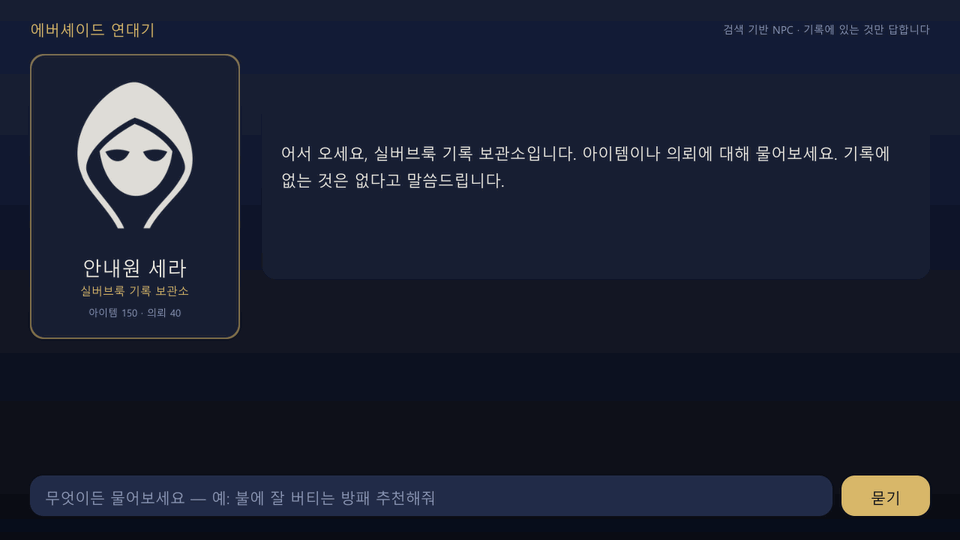

# game-asset-rag — 게임 리소스 자동 라벨링 + RAG NPC

> 아이템 아이콘을 비전 LLM으로 자동 라벨링해 문서를 보강하고, 의미 검색(임베딩)으로 찾은 근거만 인용해 답하는 게임 내 NPC.
> **이 저장소의 핵심은 데모가 아니라 평가다** — 조건 4개를 같은 정답셋으로 비교한 수치를 싣는다.

이 저장소는 Claude Code와 함께 작성했습니다. 문제 정의·설계·테스트 시나리오·검증 판정과 최종 결정은 본인이 했고, 구현 초안과 반복 작업은 AI가 보조했습니다. 커밋 이력의 `Co-Authored-By` 트레일러가 그 기록입니다.

---

## 데모 — Unity NPC



질문 세 개를 차례로 묻는다: 능력치로 찾는 질문 → **아이콘 생김새로 찾는 질문**("뱀이 감겨 있는 지팡이" — 아이템 설명에는 뱀이라는 말이 없고, 자동 라벨이 아이콘에서 읽어낸 정보로만 찾을 수 있다) → **데이터에 답이 없는 질문**(지어내지 않고 "기록에 없음"). 답 아래 카드는 답변 모델이 근거로 인용한 문서이고, 아이콘은 서버가 내려준다.

- Unity 6 · uGUI. 화면은 실행 시 코드로 만든다(`unity/Assets/Scripts/NpcDialogUI.cs`). 클라이언트가 아는 것은 서버 주소뿐이다 — **API 키는 로컬 서버(`src/server.py`)에만 있다.**
- 영상은 배치 모드 PlayMode 테스트로 찍었다(`unity/Assets/Tests/NpcDemoCapture.cs`). 답은 촬영 전에 한 번 물어 서버 캐시에 올려 두었고 화면의 대기 구간은 1.4초로 고정했다. **실제 생성 시간은 화면 오른쪽 아래 상태줄에 찍힌 값**(Sonnet 5, 2.5 ~ 5.1초)이며, 전체 분포는 아래 답변 생성 결과에 있다. [MP4](docs/images/npc-demo.mp4)

## 무엇을 푸는가

게임에는 아이템·퀘스트 설명이 수백~수만 건 쌓인다. 플레이어(또는 NPC)가 "불에 강한 방패 뭐 있어?"라고 물으면, 설명 텍스트만 키워드로 뒤져서는 잘 걸리지 않는다. **정보의 일부가 아이콘 이미지에만 있기 때문이다** — 어떤 형태인지, 한손인지 양손인지, 무엇으로 만들어졌는지.

2019년 석사 연구(「키워드 요약 및 자연어 처리기법을 이용한 의도 기반 문서 검색 시스템」)에서 같은 문제를 다뤘다. 당시에는 OCR과 객체 라벨로 이미지 정보를 본문에 합치고, 직접 학습한 Word2vec으로 의미 검색을 했다. **그때 못 한 두 가지를 지금 기술로 채우는 것이 이 저장소다.**

| 석사 연구(2019) | 이 프로젝트(2026) |
|---|---|
| Cloud Vision OCR·Label Detection으로 이미지 정보 추출 | 비전 LLM이 구조화된 JSON 라벨을 생성 |
| Word2vec 직접 학습(Skip-gram, 100차원) | 임베딩 API + BM25 하이브리드 |
| **정답셋 없이** 유사도 자체를 신뢰도로 사용 | **정답셋(recall@5·MRR)으로 조건별 비교** |
| 검색까지만 | 검색 → **근거 인용 답변 생성**("데이터에 없으면 모른다") |

## 구성

```
[오프라인 파이프라인 · Python]
아이템 아이콘 + 아이템/퀘스트 설명
  → ① 자동 라벨링   비전 LLM + 구조화 출력(JSON: 분류·형태·재질·추정 용도·태그·한 줄 설명)
  → ② 문서 보강     설명 텍스트 + 자동 라벨 결합
  → ③ 인덱스        임베딩(의미) + BM25(키워드) 하이브리드
[런타임]
Unity NPC 대화 UI → 로컬 서버(Python) → ④ 검색 top-k → ⑤ LLM 답변(근거 아이템 인용)
  → Unity에 답변 + 근거 아이템 아이콘 표시
```

**API 키는 로컬 서버에만 둔다.** Unity 클라이언트에 키를 넣지 않는다 — 게임 클라이언트는 사용자 기기에서 실행되므로 키가 추출된다.

## 평가 (핵심)

| 평가 | 방법 |
|---|---|
| 라벨 품질 | 정답 = 아이콘 원작자가 붙인 이름. 사람 기준선(저자)과 모델 2종을 같은 LLM 판정관이 출처를 모른 채 채점 → 판정관은 사람 표본으로 검증 |
| **검색 품질** | 질문 50개 + 정답 아이템 ID 골든셋 → **recall@5 · MRR**<br>조건 A 텍스트만 / B 텍스트+자동 라벨 / C 하이브리드 / D 이미지 직접 임베딩 |
| 답변 충실도 | 근거 없는 주장 비율, "모른다" 처리 비율 |
| 비용·지연 | 요청당 토큰·달러, 응답 시간 |

가설은 "이미지 정보를 넣으면 검색이 좋아진다"(석사 연구의 결론)이다. **결과가 가설과 반대로 나와도 그대로 싣는다.**

## 결과 — 검색 (자세한 표: [`results/search_eval.md`](results/search_eval.md))

문서 190개 · 질문 50개 · 의미 검색(dense) 기준.

| 조건 | recall@5 | MRR | hit@1 |
|---|---|---|---|
| **A** 텍스트만 | 0.884 | 0.800 | 0.700 |
| **B** 텍스트 + 자동 라벨 (Sonnet 5) | **0.974** | **0.889** | **0.800** |
| **B′** 텍스트 + 자동 라벨 (Haiku 4.5) | 0.914 | 0.851 | 0.780 |
| **C** B + 키워드 결합(hybrid) | 0.911 | 0.874 | 0.780 |
| **D** 텍스트 + 아이콘 이미지 (멀티모달) | 0.929 | 0.808 | 0.680 |
| D0 — D 와 같은 모델, 이미지 없이(대조군) | 0.860 | 0.767 | 0.660 |

**1. 가설은 지지된다 — 단, 이득은 '시각 질문'에만 있다.** 유형별 recall@5:

| | 속성 (9) | 용도 (11) | 설정 (10) | 교차 (8) | **시각 (12)** |
|---|---|---|---|---|---|
| A 텍스트만 | 0.913 | 1.000 | 1.000 | 0.938 | **0.625** |
| B Sonnet 5 라벨 | 0.913 | 1.000 | 1.000 | 0.938 | **1.000** |
| B′ Haiku 4.5 라벨 | 0.798 | 1.000 | 1.000 | 0.938 | 0.833 |
| D 멀티모달 | 0.830 | 0.955 | 1.000 | 0.938 | 0.917 |

"뱀이 감겨 있는 지팡이"는 텍스트만으로는 59위였고 라벨을 붙이자 1위가 됐다. 반대로 능력치·설정·퀘스트를 묻는 질문에서는 **아무 차이가 없다.** 전체 평균(0.884 → 0.974)만 보면 효과가 과장된다 — 시각 질문은 이미지 정보가 유리하도록 설계된 질문군이기 때문이다.

**2. 라벨 품질이 그대로 검색 품질이 된다.** 라벨 정확도 88%인 Sonnet 5 라벨은 질문 10개를 올리고 3개를 내렸다. 66%인 Haiku 4.5 라벨은 10개를 올리고 **6개를 내렸으며, 이미지와 무관한 속성 질문의 recall 을 0.913 → 0.798 로 떨어뜨렸다.** 틀린 라벨은 없는 것보다 나쁘다. 라벨링 비용 차이는 150건에 $0.38 이었다.

**3. 이미지를 직접 임베딩하는 것(D)보다 LLM 으로 글로 풀어 쓰는 것(B)이 나았다.** 같은 멀티모달 모델에서 이미지를 넣으면 시각 질문이 0.583 → 0.917 로 오르므로 이미지 정보 자체는 쓸모가 있다(D0 → D). 하지만 B 의 1.000 에는 못 미쳤고, 멀티모달 모델은 텍스트 검색 자체가 텍스트 전용 모델보다 약했다(D0 0.860 < A 0.884). 2019년 석사 연구에서 이미지 정보를 **글자로 바꿔** 본문에 합쳤던 방식이, 2026년의 멀티모달 임베딩과 견줘도 이 데이터에서는 여전히 더 낫다.

**4. 키워드 결합(hybrid)은 도움이 되지 않았다.** 예상과 반대다. 형태소 분석기 없이 문자 바이그램으로 만든 BM25 가 약했고(recall@5 0.79), 질문을 설명문과 다른 말로 바꿔 썼기 때문에 키워드가 잘 안 걸린다. 약한 검색기를 섞으면 강한 쪽이 끌려 내려간다 — 제대로 된 한국어 토크나이저로 다시 재 볼 항목이다.

**통계적 한계.** 질문이 50개뿐이다. A → B 는 10승 3패(부호 검정 양측 p = 0.09)로, 방향은 뚜렷하지만 관례적 유의수준에는 못 미친다. 시각 질문은 12개다. 위 수치는 "이 데이터에서 이렇게 나왔다"이지 일반화된 결론이 아니다.

## 결과 — 답변 생성 (자세한 표·전체 답변: [`results/answer_eval.md`](results/answer_eval.md))

검색(B·dense) 상위 5개 문서만 주고 답하게 했다. 답은 JSON 스키마로 강제한다 — `answerable`(문서 안에 답이 있는가) · `answer` · `cited_ids`(근거 문서). 질문 26개 = 답이 있는 질문 20개(유형 5개 × 4개, 고정 시드로 추출) + **데이터에 답이 없는 질문 6개**.

| | Opus 5 | Sonnet 5 |
|---|---|---|
| 근거 없는 주장 / 전체 주장 (LLM 판정관) | 2 / 156 (1.3%) | 0 / 108 (0.0%) |
| 답 없는 질문에 "모른다" | 5 / 6 | 6 / 6 |
| 답 있는 질문에 정답 문서를 인용해 답함 | 19 / 20 | 19 / 20 |
| 검색 결과 밖의 문서를 인용한 답 | 0 / 26 | 0 / 26 |
| 요청당 비용 (입력 약 3,000 토큰) | $0.0207 | $0.0078 |
| 지연 중앙값 / p90 | 4.7초 / 6.3초 | 3.7초 / 4.4초 |

**1. 지어낸 답은 사실상 없었다.** 두 모델 모두 문서 밖의 아이템·수치를 만들어 내지 않았고, 없는 문서 id 를 인용한 적도 없다. Opus 5 의 2건은 "도움 되는 것은 세 가지"(개수 단정)와 "결혼식 아이템은 문서에 없다"(아이콘 라벨에 '약혼·결혼 반지'라는 말이 있었다) — 둘 다 경계선의 판정이라 원문을 리포트에 그대로 실었다.

**2. 두 모델이 똑같이 틀린 1건은 답변 모델의 잘못이 아니라 라벨의 잘못이다.** "해골이 달린 지팡이"는 검색이 정답 문서를 2위로 찾아왔는데도 두 모델 모두 "그런 지팡이는 없다"고 답했다. 자동 라벨이 그 아이콘(원작자 이름 `skull-staff`)을 "초승달과 열쇠"로 읽었기 때문에, 답변 모델이 받은 문서 어디에도 해골이라는 말이 없다. **문서에 충실한 답이 곧 틀린 답이 됐다.** 검색 지표(recall@5)는 이 질문을 성공으로 세지만 사용자는 답을 못 얻는다 — 검색 평가만으로는 보이지 않고, 라벨 오류 12%가 끝까지 전파된다는 것을 끝단 평가가 잡아냈다.

**3. "모른다"의 경계는 질문 설계의 문제이기도 하다.** Opus 5 가 "모른다"고 하지 않은 1건은 "총이나 화약 무기는 어디서 구해"에 "화약 무기는 없지만 총 형태로는 '고래잡이 작살총'이 있다"고 답한 것이다. 지어낸 내용은 없고(판정관: 근거 없는 주장 0), 데이터에 실제로 '작살총'이 있다. 같은 문서를 보고 Sonnet 5 는 "없다"고 했다. 이 질문을 '답 없음'으로 분류한 골든셋 쪽이 애매했다 — 결과를 본 뒤에 정답을 바꾸지 않는다는 원칙에 따라 그대로 5/6 으로 싣는다.

**4. 이 과제에서는 더 작은 모델로 충분하다.** 문서 5개를 읽고 조건을 대조해 2~4문장으로 답하는 일에서 Sonnet 5 는 Opus 5 와 정답 수가 같고, 비용은 38%, 지연은 1초 짧다. Opus 5 는 답이 더 길고(주장 156개 대 108개) 대안을 더 많이 든다 — 그만큼 인용 정밀도가 낮다(0.80 대 0.89). NPC 대화처럼 지연이 체감되는 자리에는 Sonnet 5 가 맞는 선택이고, 그래서 데모 서버의 기본 모델도 Sonnet 5 다. 단, 질문 26개에서 1건 차이는 우열의 근거가 못 된다.

**한계.** 충실도 판정관(Opus 5)은 답변 모델과 같은 계열이고, 라벨 판정관과 달리 **사람 표본 검증을 아직 거치지 않았다.** 답 없는 질문은 6개뿐이다. 지연은 한국에서 공개 API 를 순차 호출한 실측이며, Opus 5 에서 1건("하늘을 날게 해주는 물약", 146.8초)이 튀었다. 따로 확인해 보니 우연이 아니었다 — 재시도를 끄고 같은 요청을 다시 보내도 124.6초(출력 136토큰)였고, **JSON 스키마 강제만 빼면 같은 입력이 4.5초**(첫 토큰 2.3초)에 끝난다. 같은 스키마로 Sonnet 5 는 2.8초다. 즉 Opus 5 의 구조화 출력 경로가 이 입력에서만 멈추는 현상이며 API 안쪽의 원인은 알 수 없다. 중앙값·p90 에는 영향이 없지만, 실서비스라면 요청 타임아웃과 "스키마 없이 다시 요청 → 직접 검증" 폴백이 필요하다는 뜻이다.

## 한계 (미리 밝힘)

- 데이터 규모가 작다(아이템 150 · 퀘스트 40). 전용 벡터 DB 없이 파일 기반 인덱스를 쓰는 이유다.
- **아이콘이 흑백 실루엣이다.** 그래서 자동 라벨이 뽑아낼 수 있는 것은 형태·구성 요소·물건의 종류까지이고, 색·재질은 애초에 이미지에 없다. 조건 B·D의 상한이 여기서 정해진다 — 컬러 아트였다면 결과가 달랐을 수 있다는 점을 결과 해석에 같이 적는다.
- 사람 기준선과 판정관 검증 표본은 저자 1인이 채점했다. 평가자 간 일치도는 측정하지 않았다.
- 답변 충실도는 LLM 판정관만으로 쟀다(사람 표본 검증 전). 근거 없음으로 찍힌 주장과 전체 답변을 리포트에 원문으로 실어 직접 확인할 수 있게 했다.
- 게임 데이터는 전부 이 저장소를 위해 창작한 가상 데이터다. 실제 상용 게임 IP·데이터는 쓰지 않았다.

## 라이선스

- 코드·문서·창작 게임 데이터(아이템·퀘스트 텍스트): [MIT](LICENSE)
- 아이콘 150개와 NPC 초상: [game-icons.net](https://game-icons.net) — **CC BY 3.0**(MIT 아님). 원작자 표기는 아래와 `data/icons/ATTRIBUTION.md`

## 데이터·에셋 출처

- 아이템/퀘스트 텍스트: 본 저장소용 창작(2026-09)
- NPC 초상(`unity/Assets/Resources/npc_portrait.bytes`): game-icons.net 의 `cowled` — Icon made by lorc, CC BY 3.0. 흑백 반전만 실행 시 코드로 한다.
- 아이콘: [game-icons.net](https://game-icons.net) — Creative Commons 3.0 BY. 아이콘별 원작자는 `data/icon_map.csv`의 `icon_author` 열에 기록했다. 자세한 표기는 [`data/icons/ATTRIBUTION.md`](data/icons/ATTRIBUTION.md).

## 실행

```bash
pip install -r requirements.txt
cp .env.example .env           # ANTHROPIC_API_KEY / VOYAGE_API_KEY 채우기 (.env 는 커밋되지 않음)

# ① 자동 라벨링 — 아이콘 이미지만 보고 JSON 라벨 생성 (Batch API, 50% 할인)
python src/label_icons.py --model claude-sonnet-5
python src/label_icons.py --model claude-haiku-4-5
python src/label_icons.py --model claude-sonnet-5 --limit 3 --sync   # 소량 확인용

# 라벨 채점: 사람 기준선 작성 → LLM 판정 → 판정관 검증 → 리포트
python src/make_gold_tool.py            # tools/label_gold.html  (아이콘만 보고 답 적기)
python src/judge_labels.py              # 원작자 이름 vs 답 → match/partial/miss
python src/make_judge_check_tool.py     # tools/judge_check.html (판정관 검증용 블라인드 표본)
python src/compare_labels.py            # results/label_comparison.md

# ② 검색 평가 — 조건 A/B/B′/C/D (임베딩은 data/cache/ 에 캐시)
python src/build_golden.py              # eval/golden_queries.jsonl 검증·생성
python src/search_eval.py && python src/report_search.py      # results/search_eval.md

# ③ 답변 생성 평가 — 검색 top-5 → 근거 인용 답변 → 주장 단위 충실도 판정
python src/rag.py "불에 잘 버티는 방패 추천해줘"              # 한 건 돌려 보기
python src/answer_eval.py --limit 3     # 비용·지연을 먼저 3건으로 실측
python src/answer_eval.py && python src/answer_eval.py --model claude-sonnet-5
python src/judge_answers.py && python src/report_answers.py   # results/answer_eval.md

# ④ NPC 데모 — 로컬 서버를 띄우고 Unity 6 로 unity/ 를 열어 Assets/Scenes/NpcDemo 실행
python src/server.py                    # http://127.0.0.1:8765  (기본 Sonnet 5 — ANSWER_MODEL=claude-opus-5 로 교체)
```

데이터셋을 처음부터 다시 만들려면 아이콘 아카이브를 받아 `python src/build_icon_map.py game-icons.zip` 을 돌린다.

### 라벨 품질 결과 (자세한 내용은 [`results/label_comparison.md`](results/label_comparison.md))

정답은 **아이콘 원작자가 붙인 이름**이다. 저자가 같은 아이콘을 이름·설명 없이 보고 적은 답을 **사람 기준선**으로 같이 채점했다.

| 같은 아이콘 130건 | 정확히 같은 물건 | 범주까지 인정 | 다른 물건 | 라벨링 비용 |
|---|---|---|---|---|
| 사람(저자) | 80.8% | 95.4% | 4.6% | — |
| Sonnet 5 | **88.5%** | **96.9%** | 3.1% | $0.67 |
| Haiku 4.5 | 66.2% | 80.0% | **20.0%** | $0.29 |

- Sonnet 5 는 흑백 실루엣에서도 사람 이상으로 읽는다. Haiku 4.5 는 비용이 43%지만 **5개 중 1개를 다른 물건으로 읽는다** — 이 라벨로 검색 인덱스를 만들면 그만큼 오염된다.
- '같은 물건인가'는 LLM 판정관(Opus 5)이 판정했고, 저자가 층화 표본 30건을 블라인드로 따로 채점해 확인했다: **맞음/틀림 일치 90%**, 3단계 완전 일치 63%. 어긋남은 거의 '정확히 같음'과 '범주만 같음'의 경계라서 **'범주까지 인정' 열이 더 단단한 수치**다.
- 그 불일치의 절반 이상은 채점자가 (출처를 모른 채) **자기 답을 너그럽게 채점**한 경우였다. 정답을 저자의 답이 아니라 원작자 이름에 둔 이유다.

### 평가의 공정성을 지키려고 고정해 둔 것

1. **라벨링 모델에게 아이템 이름·설명을 주지 않는다** (`src/label_icons.py`). 주면 모델이 설명을 바꿔 쓴 라벨이 나오고, 조건 B(텍스트+라벨)는 조건 A(텍스트만)의 복제가 된다.
2. **정답은 제3자의 기준(원작자 이름)** 이고, 사람·모델 모두 같은 판정관이 출처를 모른 채 채점한다.
3. **데이터셋 개정은 검색 실험 전에 끝냈다.** 라벨 품질을 점검하다 아이콘 상당수가 사람도 못 읽을 만큼 모호하다는 것을 발견했다(처음 표본에서 19%). 이름만 보고 아이콘을 고른 탓이었다. "사람이 읽을 수 있는 아이콘만 남긴다"는 기준을 150건 전체에 적용해 41건을 교체했고(5 + 18 + 18), 그 뒤 사람이 못 읽은 아이콘은 130건 중 3건이다. **모델이 틀린 아이콘을 골라 바꾼 것이 아니다** — 기준은 사람의 판독 가능성이었고, 검색 평가는 이 개정 이후에 시작했다.
4. 개정 과정에서 저자가 아이템 이름과 아이콘을 함께 봐 버린 20건은 블라인드가 깨져 **사람 채점에서 제외**했다(모델은 150건 전부 채점).
